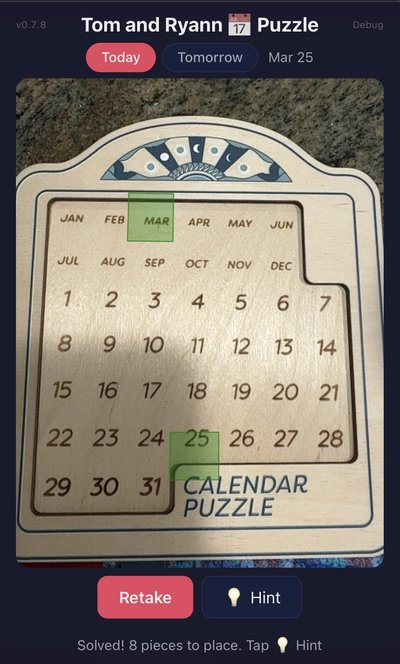
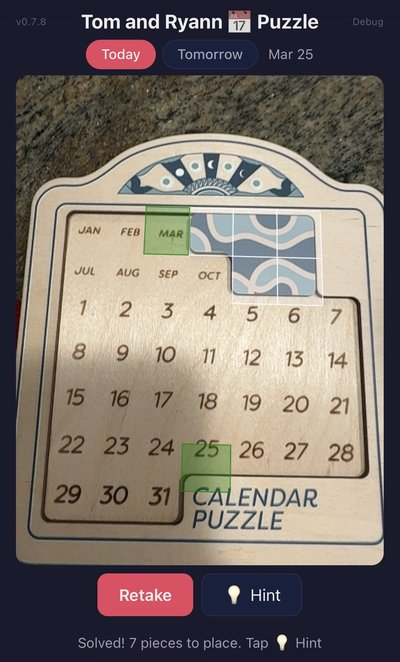
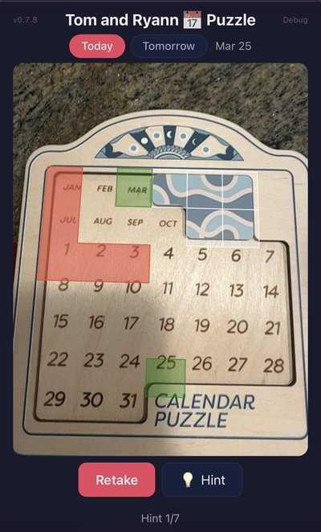

# Calendar Puzzle Solver

A mobile-first Progressive Web App that solves the daily polyomino calendar puzzle using computer vision and Knuth's Dancing Links algorithm.

Point your phone camera at the puzzle, capture a photo, and get an instant solution with step-by-step hints.

## The Puzzle

The daily polyomino calendar puzzle is an 8-piece puzzle (seven pentominoes + one hexomino) on a 7×7-ish board labeled with months and days.

Each day of the year has (at least one) solution where the cells for the current month and current day are left uncovered, and all other cells are covered by the pieces.

## How It Works

1. **Capture**: Use your phone camera to photograph your puzzle board
2. **Detect**: OpenCV.js finds the board edges, warps to a flat grid, and classifies each cell as wood or piece using color analysis
3. **Identify**: Already-placed pieces are recognized automatically so the solver only needs to fill what's left
4. **Solve**: Remaining pieces are fitted onto empty cells using Knuth's Dancing Links algorithm to find an exact cover (runtime <100ms)
5. **Hint**: Tap the hint button to reveal one piece at a time, overlaid directly on your photo

<p align="center">
  &nbsp;&nbsp;&nbsp;
  &nbsp;&nbsp;&nbsp;
  
</p>
<p align="center">
  <em>Left: empty board detected. Center: one piece already on the board, solver recognizes it. Right: hint mode reveals one piece at a time.</em>
</p>

## Tech Stack

| Layer | Technology |
|---|---|
| Computer Vision | [OpenCV.js](https://docs.opencv.org/) for edge detection, perspective warp, per-cell HSV/RGB classification |
| Solver | Knuth's Algorithm X via Dancing Links (DLX) for exact cover over 8 polyominoes |
| Camera | MediaDevices API (`getUserMedia`) with rear-camera preference |
| Rendering | Canvas 2D with solution overlay drawn on the captured photo |
| Offline | Service Worker with stale-while-revalidate caching |
| PWA | Web App Manifest, installable on iOS and Android home screens |
| Language | Vanilla ES6 modules with no build step and no framework |

## Features

- **Auto-detection** of board orientation and placed pieces via multi-threshold Canny edge detection with polygon approximation fallbacks
- **Adaptive color thresholds** that automatically find the best split between piece and wood cells
- **Tap-to-correct** lets you manually toggle misclassified cells before solving
- **Today / Tomorrow toggle** to quickly switch the target date
- **Progressive hints** that reveal pieces one at a time, upper-left first
- **Debug mode** to inspect per-cell classification scores and detection overlays
- **Works offline** after first load
- **iOS Safari & Firefox compatible** with safe-area insets and `100dvh` layout

## Project Structure

```
├── index.html          Entry point
├── css/styles.css      Mobile-first dark theme
├── js/
│   ├── app.js          Main controller: UI, camera flow, detection orchestration
│   ├── board.js        Board layout, piece definitions, date-to-cell mapping
│   ├── solver.js       Piece orientation generation + DLX matrix construction
│   ├── dlx.js          Dancing Links / Algorithm X implementation
│   ├── detect.js       OpenCV-based board detection + cell classification
│   ├── camera.js       Camera start/stop/capture wrapper
│   └── version.js      App version constant
├── sw.js               Service worker (stale-while-revalidate)
├── manifest.json       PWA manifest
└── readme-images/      Screenshots for this README
```

## License

Private project.
